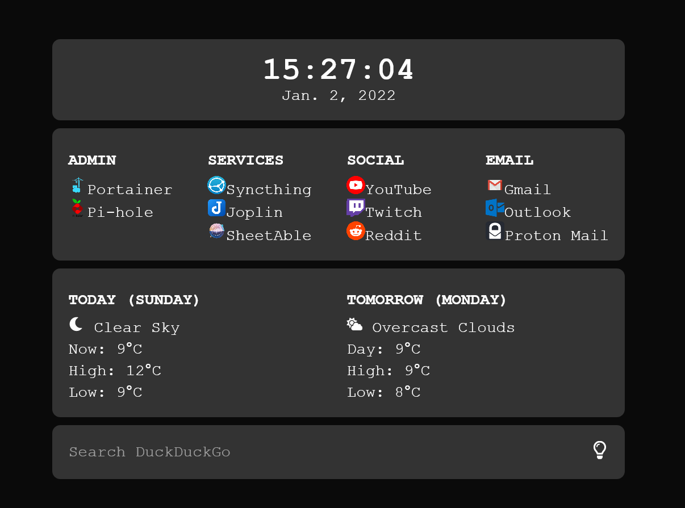

# Home Page
Very first home page to teach myself the basics of how to use HTML, CSS, JavaScript, and Node.js. Before this, I had no knowledge of any web development. 




Obvious heavy visual inspiration from [alanrey6](https://github.com/alanrey6/startpage-az). Many tweaks, comments, and changes were made just about everywhere to theirs other than the visuals. I basically wanted to improve his version and learn how to make it myself, while customizing it to my needs and adding a way to deploy it using Express.js through docker.  This repository will essentially be my notes on how it works and to run it.

## Manual Setup

[Node.js](https://nodejs.org/en/) is needed to run the HTTP server. I tested it with the [WSL2 version](https://docs.microsoft.com/en-ca/windows/dev-environment/javascript/nodejs-on-wsl).

To enable weather functionality, a `.env` file needs to be created in the root directory with an OpenWeatherMap API key along with a [location](https://www.latlong.net/). One can paste the necessary values into the `.env.sample` file then remove `.sample` from the filename.

Web links, located in `/public/js/config.js`, can be customized to whatever one desires. See [below](#web-link-config) for config details.

Install the packages in the environment with:
```bash
npm install
```

To start the web server:
```bash
node app.js
```

## Docker Setup

The `.env` file and web links should be setup in the same manner as the [manual setup](#manual-setup). Then, the docker image can be built using:
```bash
docker build . -t <your username>/homepage
```

To run the container:
```bash
docker run -p 8080:8080 -d --name homepage <your username>/homepage
```

## Web Link Config

Each entry in `/public/js/config.js` has two attributes: the column name and a list of web links.
```
{
    name: "Admin",
    links: [
        {
            href: "",
            target: "_blank",
            content: "Portainer",
            icon: "https://i.imgur.com/729Hh3P.png"
        },
        {
            href: "",
            target: "_blank",
            content: "Pi-hole",
            icon: "https://pi-hole.github.io/graphics/Vortex/Vortex_with_Wordmark.svg"
        },
    ]
}
```
- `href` is the web address to link to.
- `target` specifies where to open the link.
- `content` is the displayed text.
- `icon` is the local or remote icon image location.


## Other Links to Read
- [https://stpg.tk/guides/basic-startpage/](https://stpg.tk/guides/basic-startpage/)
- [https://developer.mozilla.org/en-US/docs/Learn/Getting_started_with_the_web/HTML_basics](https://developer.mozilla.org/en-US/docs/Learn/Getting_started_with_the_web/HTML_basics)
- [https://developer.mozilla.org/en-US/docs/Learn/Getting_started_with_the_web/CSS_basics](https://developer.mozilla.org/en-US/docs/Learn/Getting_started_with_the_web/CSS_basics)
- [https://developer.mozilla.org/en-US/docs/Learn/Getting_started_with_the_web/JavaScript_basics](https://developer.mozilla.org/en-US/docs/Learn/Getting_started_with_the_web/JavaScript_basics)
- [https://gist.github.com/jkrems/b14894e0b8efde10aa10a28c652d3541](https://gist.github.com/jkrems/b14894e0b8efde10aa10a28c652d3541)
- [https://nodejs.org/en/docs/guides/nodejs-docker-webapp/](https://nodejs.org/en/docs/guides/nodejs-docker-webapp/)